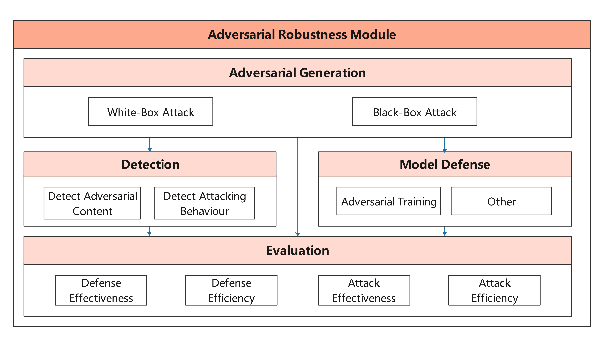
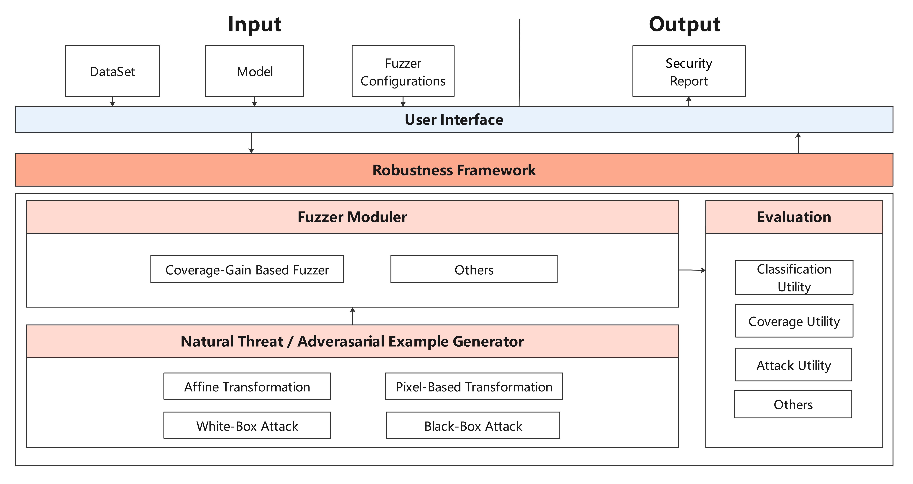
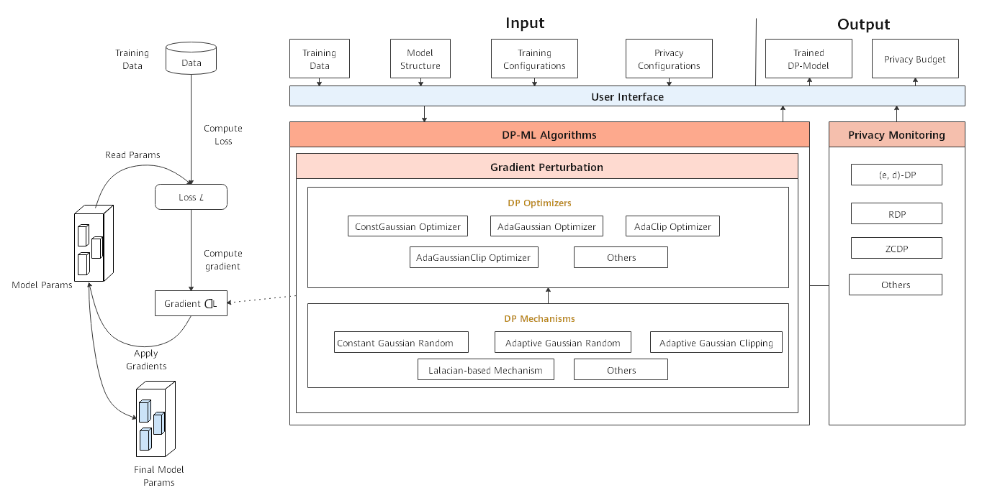
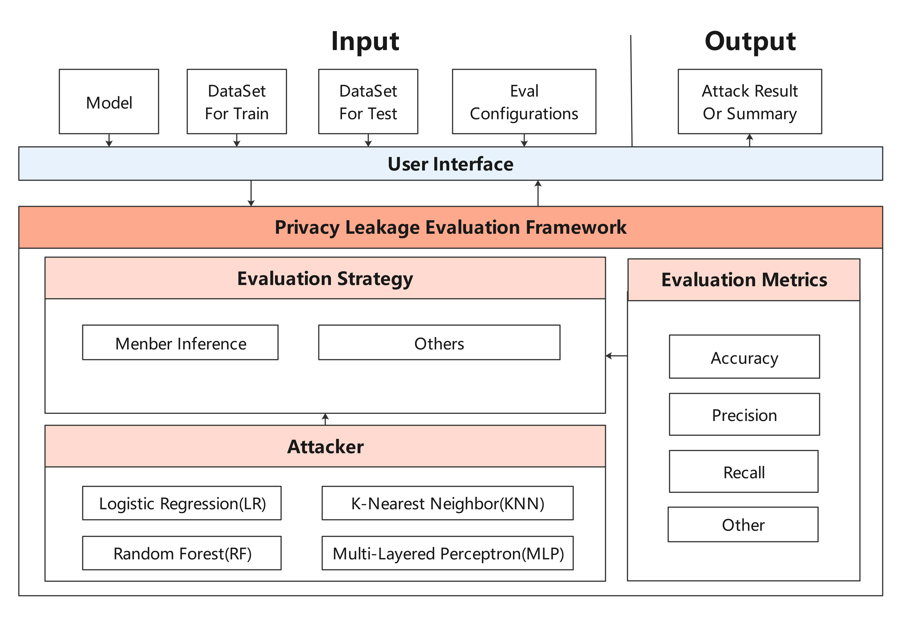

# MindArmour

<!-- TOC -->

- [MindArmour](#mindarmour)
    - [What is MindArmour](#what-is-mindarmour)
        - [Adversarial Robustness Module](#adversarial-robustness-module)
        - [Fuzz Testing Module](#fuzz-testing-module)
        - [Privacy Protection and Evaluation Module](#privacy-protection-and-evaluation-module)
            - [Differential Privacy Training Module](#differential-privacy-training-module)
            - [Privacy Leakage Evaluation Module](#privacy-leakage-evaluation-module)
    - [Starting](#starting)
        - [System Environment Information Confirmation](#system-environment-information-confirmation)
        - [Installation](#installation)
            - [Installation by Source Code](#installation-by-source-code)
            - [Installation by pip](#installation-by-pip)
        - [Installation Verification](#installation-verification)
    - [Docs](#docs)
    - [Community](#community)
    - [Contributing](#contributing)
    - [Release Notes](#release-notes)
    - [License](#license)

<!-- /TOC -->

[查看中文](./README_CN.md)

## What is MindArmour

MindArmour focus on security and privacy of artificial intelligence. MindArmour can be used as a tool box for MindSpore users to enhance model security and trustworthiness and protect privacy data. MindArmour contains three module: Adversarial Robustness Module, Fuzz Testing Module, Privacy Protection and Evaluation Module.

### Adversarial Robustness Module

Adversarial robustness module is designed for evaluating the robustness of the model against adversarial examples, and provides model enhancement methods to enhance the model's ability to resist the adversarial attack and improve the model's robustness.
This module includes four submodule: Adversarial Examples Generation, Adversarial Examples Detection, Model Defense and Evaluation.

The architecture is shown as follow：



### Fuzz Testing Module

Fuzz Testing module is a security test for AI models. We introduce neuron coverage gain as a guide to fuzz testing according to the characteristics of neural networks.
Fuzz testing is guided to generate samples in the direction of increasing neuron coverage rate, so that the input can activate more neurons and neuron values have a wider distribution range to fully test neural networks and explore different types of model output results and wrong behaviors.

The architecture is shown as follow：



### Privacy Protection and Evaluation Module

Privacy Protection and Evaluation Module includes two modules: Differential Privacy Training Module and Privacy Leakage Evaluation Module.

#### Differential Privacy Training Module

Differential Privacy Training Module implements the differential privacy optimizer. Currently, `SGD`, `Momentum` and `Adam` are supported. They are differential privacy optimizers based on the Gaussian mechanism.
This mechanism supports both non-adaptive and adaptive policy. Rényi differential privacy (RDP) and Zero-Concentrated differential privacy（ZCDP） are provided to monitor differential privacy budgets.

The architecture is shown as follow：



#### Privacy Leakage Evaluation Module

Privacy Leakage Evaluation Module is used to assess the risk of a model revealing user privacy. The privacy data security of the deep learning model is evaluated by using membership inference method to infer whether the sample belongs to training dataset.

The architecture is shown as follow：



## Starting

### System Environment Information Confirmation

- The hardware platform should be Ascend, GPU or CPU.
- See our [MindSpore Installation Guide](https://www.mindspore.cn/install) to install MindSpore.  
    The versions of MindArmour and MindSpore must be consistent.
- All other dependencies are included in [setup.py](https://gitee.com/mindspore/mindarmour/blob/master/setup.py).

### Installation

### Version dependency

Due the dependency between MindArmour and MindSpore, please follow the table below and install the corresponding MindSpore verision from [MindSpore download page](https://www.mindspore.cn/versions/en).

| MindArmour Version | Branch                                                    | MindSpore Version |
| ------------------ | --------------------------------------------------------- | ----------------- |
| 2.0.0              | [r2.0](https://gitee.com/mindspore/mindarmour/tree/r2.0/) | 1.7.0 -           |
| 1.9.0              | [r1.9](https://gitee.com/mindspore/mindarmour/tree/r1.9/) | 1.7.0 -           |
| 1.8.0              | [r1.8](https://gitee.com/mindspore/mindarmour/tree/r1.8/) | 1.7.0 -           |
| 1.7.0              | [r1.7](https://gitee.com/mindspore/mindarmour/tree/r1.7/) | r1.7              |

#### Installation by Source Code

1. Download source code from Gitee.

    ```bash
    git clone https://gitee.com/mindspore/mindarmour.git
    ```

2. Compile and install in MindArmour directory.

    ```bash
    cd mindarmour
    python setup.py install
    ```

#### Installation by pip

```bash
pip install https://ms-release.obs.cn-north-4.myhuaweicloud.com/{version}/MindArmour/{arch}/mindarmour-{version}-cp37-cp37m-linux_{arch}.whl --trusted-host ms-release.obs.cn-north-4.myhuaweicloud.com -i https://pypi.tuna.tsinghua.edu.cn/simple
```

> - When the network is connected, dependency items are automatically downloaded during .whl package installation. (For details about other dependency items, see [setup.py](https://gitee.com/mindspore/mindarmour/blob/master/setup.py)). In other cases, you need to manually install dependency items.
> - `{version}` denotes the version of MindArmour. For example, when you are downloading MindArmour 1.0.1, `{version}` should be 1.0.1.
> - `{arch}` denotes the system architecture. For example, the Linux system you are using is x86 architecture 64-bit, `{arch}` should be `x86_64`. If the system is ARM architecture 64-bit, then it should be `aarch64`.

### Installation Verification

Successfully installed, if there is no error message such as `No module named 'mindarmour'` when execute the following command:

```bash
python -c 'import mindarmour'
```

## Docs

Guidance on installation, tutorials, API, see our [User Documentation](https://gitee.com/mindspore/docs).

## Community

[MindSpore Slack](https://join.slack.com/t/mindspore/shared_invite/enQtOTcwMTIxMDI3NjM0LTNkMWM2MzI5NjIyZWU5ZWQ5M2EwMTQ5MWNiYzMxOGM4OWFhZjI4M2E5OGI2YTg3ODU1ODE2Njg1MThiNWI3YmQ) - Ask questions and find answers.

## Contributing

Welcome contributions. See our [Contributor Wiki](https://gitee.com/mindspore/mindspore/blob/master/CONTRIBUTING.md) for more details.

## Release Notes

The release notes, see our [RELEASE](RELEASE.md).

## License

[Apache License 2.0](LICENSE)
