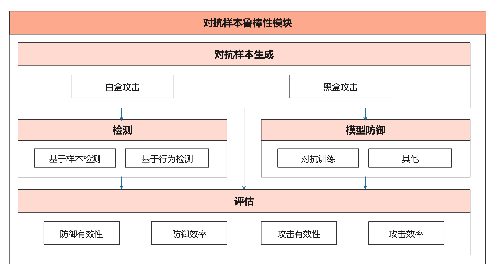
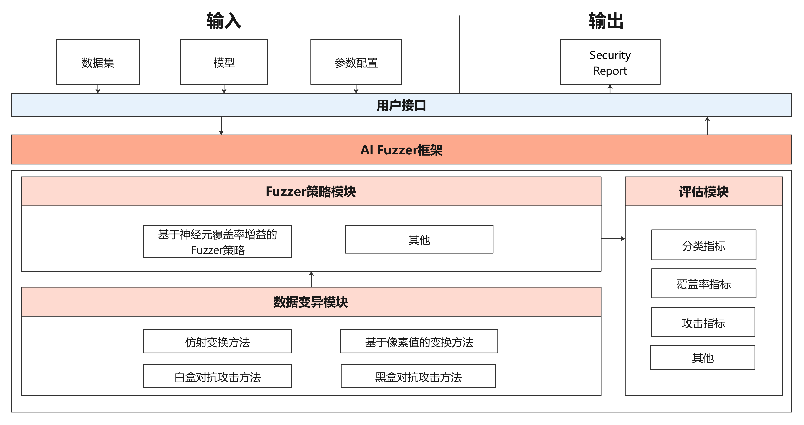
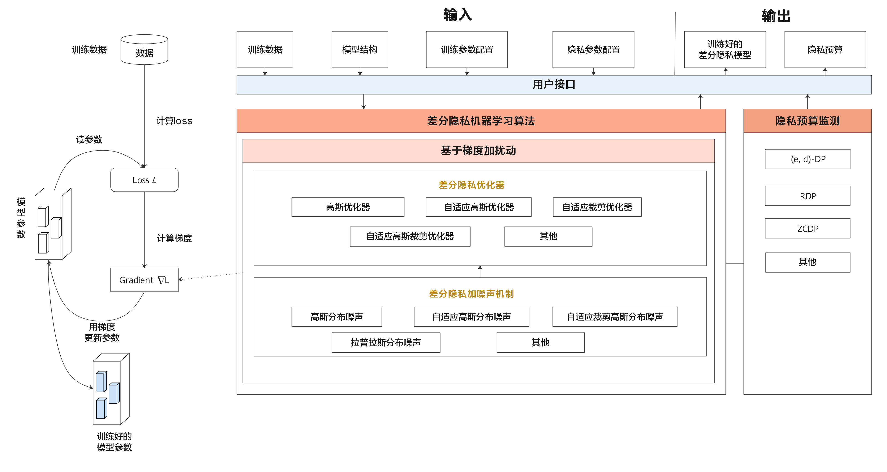
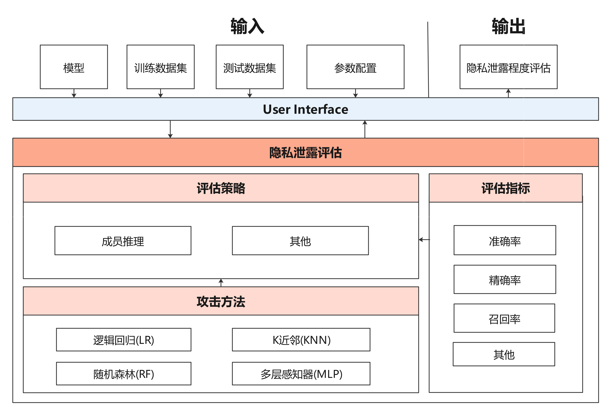

# MindArmour

- [简介](#简介)
- [开始](#开始)
- [文档](#文档)
- [社区](#社区)
- [贡献](#贡献)
- [版本](#版本)
- [版权](#版权)

[View English](./README.md)

## 简介

MindArmour关注AI的安全和隐私问题。致力于增强模型的安全可信、保护用户的数据隐私。主要包含3个模块：对抗样本鲁棒性模块、Fuzz Testing模块、隐私保护与评估模块。

### 对抗样本鲁棒性模块
对抗样本鲁棒性模块用于评估模型对于对抗样本的鲁棒性，并提供模型增强方法用于增强模型抗对抗样本攻击的能力，提升模型鲁棒性。对抗样本鲁棒性模块包含了4个子模块：对抗样本的生成、对抗样本的检测、模型防御、攻防评估。

对抗样本鲁棒性模块的架构图如下：



### Fuzz Testing模块
Fuzz Testing模块是针对AI模型的安全测试，根据神经网络的特点，引入神经元覆盖率，作为Fuzz测试的指导，引导Fuzzer朝着神经元覆盖率增加的方向生成样本，让输入能够激活更多的神经元，神经元值的分布范围更广，以充分测试神经网络，探索不同类型的模型输出结果和错误行为。

Fuzz Testing模块的架构图如下：



### 隐私保护模块

隐私保护模块包含差分隐私训练与隐私泄露评估。

#### 差分隐私训练模块

差分隐私训练包括动态或者非动态的差分隐私SGD、Momentum、Adam优化器，噪声机制支持高斯分布噪声、拉普拉斯分布噪声，差分隐私预算监测包含ZCDP、RDP。

差分隐私的架构图如下：



#### 隐私泄露评估模块

隐私泄露评估模块用于评估模型泄露用户隐私的风险。利用成员推理方法来推测样本是否属于用户训练数据集，从而评估深度学习模型的隐私数据安全。

隐私泄露评估模块框架图如下：




## 开始

### 环境依赖

MindArmour使用MindSpore加速计算，因此请先安装MindSpore，其余依赖包含在`setup.py`里。

### 安装

#### 源码安装

1. 从Gitee下载源码。

```bash
git clone https://gitee.com/mindspore/mindarmour.git
```

2. 编译安装MindArmour。

```bash
$ cd mindarmour
$ python setup.py install
```

#### `Pip`安装 

1. 从[MindSpore官网](https://www.mindspore.cn/versions/en)下载whl格式的安装包，然后执行如下命令：

```
pip install mindarmour-{version}-cp37-cp37m-linux_{arch}.whl
```

2. 执行如下命令，如果没有报错`No module named 'mindarmour'`，则说明安装成功。

```bash
python -c 'import mindarmour'
```

## 文档

安装指导、使用教程、API，请参考[用户文档](https://gitee.com/mindspore/docs)。

## 社区

社区问答：[MindSpore Slack](https://join.slack.com/t/mindspore/shared_invite/enQtOTcwMTIxMDI3NjM0LTNkMWM2MzI5NjIyZWU5ZWQ5M2EwMTQ5MWNiYzMxOGM4OWFhZjI4M2E5OGI2YTg3ODU1ODE2Njg1MThiNWI3YmQ)。
## 贡献

欢迎参与社区贡献，详情参考[Contributor Wiki](https://gitee.com/mindspore/mindspore/blob/master/CONTRIBUTING.md)。

## 版本

版本信息参考：[RELEASE](RELEASE.md)。

## 版权

[Apache License 2.0](LICENSE)
