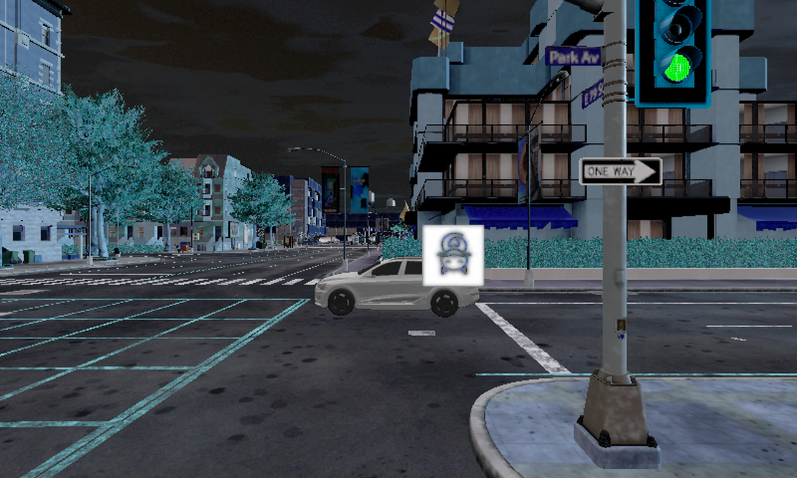

目录

<!-- TOC -->

- [目录](#目录)
- [DAS描述](#DAS描述)
- [数据集](#数据集)
- [模型](#模型)
- [环境要求](#环境要求)
- [脚本说明](#脚本说明)
    - [脚本及样例代码](#脚本及样例代码)
    - [脚本参数](#脚本参数)
    - [训练过程](#训练过程)
    - [评估过程](#评估过程)
    - [随机情况说明](#随机情况说明)

<!-- /TOC -->

# DAS描述

Dual Attention Suppression Attack (DAS) 是一种物理世界对抗样本生成方法，同时采用模型注意力与人类视觉注意力抑制策略来提升对抗样本的黑盒迁移攻击性。原论文基于可微渲染器实现3D对抗车辆纹理生成，此复现则应用于2D图像场景。

[论文](https://openaccess.thecvf.com/content/CVPR2021/papers/Wang_Dual_Attention_Suppression_Attack_Generate_Adversarial_Camouflage_in_Physical_World_CVPR_2021_paper.pdf):  Dual Attention Suppression Attack: Generate Adversarial Camouflage in Physical World
[代码](https://github.com/nlsde-safety-team/DualAttentionAttack)

# 数据集

使用了1000张基于CARLA仿真环境生成的车辆图像数据集，其中800张用于训练，200张用于测试。数据[下载](https://openi.pcl.ac.cn/Yzx835/dual_attention_suppression/datasets)后保存在car_dataset 文件夹中。
目录结构如下：

```shell
.
├── annotation_labels.json  # 标注jsons
├── train                   # 训练数据集
└── test                    # 推理数据集
```

# 模型

训练用模型采用基于mindspore框架的[YOLOv3 Tiny](https://gitee.com/mindspore/models/tree/r1.9/research/cv/yolov3_tiny)，YOLOv3 Tiny是YOLOv3的一个轻量级变体，使用YOLOv3 Tiny 进行检测时，运行时间更短，准确性更低。 YOLOv3 Tiny使用了池层，减少了卷积层的数量。它预测一个三维张量，其中包含两个不同尺度的置信度得分、边界框和类预测。 预训练模型的ckpt路径为：https://www.mindspore.cn/resources/hub/details?MindSpore/1.8/yolov3tiny_coco2017

# 环境要求

- 硬件（Ascend/CPU/GPU）
- 框架
    - [MindSpore-2.0.0-aplha](https://www.mindspore.cn/versions#2.0.0-alpha)
- 如需查看详情，请参见如下资源：
    - [MindSpore教程](https://www.mindspore.cn/tutorials/zh-CN/r1.9/index.html)
    - [MindSpore Python API](https://www.mindspore.cn/docs/zh-CN/r1.9/index.html)

# 脚本说明

## 脚本及样例代码

```text
└── DAS-MS
        ├── README.md                        // DAS相关说明
        ├─model_utils
            ├── __init__.py                  // 初始化脚本
            ├── config.py                    // 参数配置项
            ├── device_adapter.py            // ModelArts的设备适配器
            ├── local_adapter.py             // 本地适配器
            └── moxing_adapter.py            // ModelArts的模型适配器
        ├── src
            ├─__init__.py                    // 初始化脚本
            ├─tiny.py                        // 主干网络
            ├─distributed_sampler.py         // 数据采样
            ├─initializer.py                 // 参数初始化
            ├─logger.py                      // 日志
            ├─loss.py                        // 损失函数
            ├─lr_scheduler.py                // 学习率生成器
            ├─transforms.py                  // 数据预处理模块
            ├─util.py                        // 工具函数
            ├─yolo.py                        // yolo 网络
            └──yolo_dataset.py                // 构建数据模块
        ├── split.py                         // 数据集划分脚本
        ├── main.py                          // 对抗样本生成脚本
        └── eval_custom.py                   // 验证脚本
```

## 脚本参数

参考`default_config.yaml`

## 训练过程

单机模式

```shell script
python main.py
```

样例

```text
{'data_dir': 'Train dataset directory.', 'per_batch_size': 'Batch size for Training.', 'pretrained_backbone': 'The ckpt file of backbone.', 'resume_yolo': 'The ckpt file of YOLO, which used to fine tune.', 'lr_scheduler': 'Learning rate scheduler, options: exponential, cosine_annealing.', 'lr': 'Learning rate.', 'lr_epochs': "Epoch of changing of lr changing, split with ',' .", 'lr_gamma': 'Decrease lr by a factor of exponential lr_scheduler.', 'eta_min': 'Eta_min in cosine_annealing scheduler.', 't_max': 't-max in cosine_annealing scheduler.', 'max_epoch': 'Max epoch num to train the model.', 'warmup_epochs': 'Warmup epochs.', 'weight_decay': 'Weight decay factor.', 'momentum': 'Momentum.', 'loss_scale': 'Static loss scale.', 'label_smooth': 'Whether to use label smooth in CE.', 'label_smooth_factor': 'Smooth strength of original one-hot.', 'log_interval': 'Logging interval steps.', 'ckpt_path': 'Checkpoint save location.', 'ckpt_interval': 'Save checkpoint interval.', 'is_save_on_master': 'Save ckpt on master or all rank, 1 for master, 0 for all ranks.', 'is_distributed': 'Distribute train or not, 1 for yes, 0 for no.', 'rank': 'Local rank of distributed.', 'group_size': 'World size of device.', 'need_profiler': 'Whether use profiler. 0 for no, 1 for yes.', 'training_shape': 'Fix training shape.', 'resize_rate': 'Resize rate for multi-scale training.', 'pretrained': 'model_path, local pretrained model to load.', 'log_path': 'checkpoint save location.', 'nms_thresh': 'threshold for NMS.', 'ann_file': 'path to annotation.', 'testing_shape': 'shape for test.', 'eval_ignore_threshold': 'threshold to throw low quality boxes for eval.', 'multi_label': 'whether to use multi label.', 'multi_label_thresh': 'threshold to throw low quality boxes.', 'device_id': 'Device id', 'batch_size': 'batch size', 'ckpt_file': 'Checkpoint file path.', 'file_name': 'output file name.', 'file_format': "file format choices in ['AIR', 'ONNX', 'MINDIR']", 'device_target': "device target. choices in ['Ascend', 'GPU'] for train. choices in ['Ascend', 'GPU', 'CPU'] for export.", 'keep_detect': 'keep the detect module or not, default: True', 'input_file': 'input file path.', 'output_file': 'output file path.'}
Loss: 0.15873426109484723
Loss: 0.1602887338388026
Loss: 0.1495473677437818
Loss: 0.10895679700994924
Loss: 0.09400761125614869
Loss: 0.09335179864920702
Loss: 0.10233184240378973
Loss: 0.08989452708628823
Loss: 0.08637967007942787
Loss: 0.06734889755365095
Loss: 0.11089157071595997
Loss: 0.07352601629535291
Loss: 0.06127857275835673
Loss: 0.06339467453803241
Loss: 0.06459638432323421
Loss: 0.06275386731890974
Loss: 0.052050032487549885
Loss: 0.049994596780666575
Loss: 0.09031482289790949
Loss: 0.046804235350012456
Loss: 0.04950655710187889
Loss: 0.05675044202545194
Loss: 0.08744812814658535
Loss: 0.047282984597007895
Loss: 0.06074624398306123
Loss: 0.09450093783779531
Loss: 0.05525713405467163
Loss: 0.08672434315923745
Loss: 0.06536082907444357
Loss: 0.0708689233698673
Loss: 0.0646240050873516
Loss: 0.0868441630442587
Loss: 0.03464651248502987
Loss: 0.06337182856463931
Loss: 0.05224160775273571
Loss: 0.027919265736080303
Loss: 0.027048698872851704
Loss: 0.034400558571434474
Loss: 0.05861713609233034
Loss: 0.027229743058941817
Loss: 0.046821756443092145
Loss: 0.06055881844218076
Loss: 0.06506348464001656
Loss: 0.038481164555930106
Loss: 0.027972260051579715
Loss: 0.059517855417176274
Loss: 0.05049438486419868
Loss: 0.03433547945653122
Loss: 0.033471468367669524
Loss: 0.03370498510211389
Loss: 0.07851158686007395
Loss: 0.07166514090696645
Loss: 0.056172923817803304
Loss: 0.026673509123164667
Loss: 0.06462378739466138
Loss: 0.02946279533340824
Loss: 0.04479456061974775
Loss: 0.04601205942330584
Loss: 0.028881376114464716
Loss: 0.049903557959787626
Loss: 0.02606452076601446
Loss: 0.03309130350965938
Loss: 0.05789853010938016
Loss: 0.02539757929857044
Loss: 0.016625707660340217
Loss: 0.023597306408989296
Loss: 0.03083821584607973
Loss: 0.0473822300475272

...
```

关键参数设置

```python
TRAIN_DATA_PATH = './car_dataset/train/images'
PATCH_SIZE = 100
EPOCH = 2
STEP_SIZE = 0.1
ATTACK_ITERS = 2
```

生成的对抗补丁会保存为`patch.npy`，对抗样本生成样例如下



## 评估过程

  ```shell script
python eval_custom.py
  ```

  ```text
2023-03-26 16:44:33,710:INFO:Creating Network....
2023-03-26 16:44:33,921:INFO:yolov3tiny_ascend_v190_coco2017_research_cv_mAP17.5_AP50acc36.0.ckpt
2023-03-26 16:44:34,270:INFO:load_model yolov3tiny_ascend_v190_coco2017_research_cv_mAP17.5_AP50acc36.0.ckpt success
2023-03-26 16:44:34,295:INFO:Start inference....
2023-03-26 16:48:28,655:INFO:
=============eval reulst=========
 P@0.5: 0.015
2023-03-26 16:48:28,656:INFO:testing cost time 0.07h
  ```

结果保存在results文件夹中，我们采用[P@0.5](https://openreview.net/pdf?id=SJgEl3A5tm)作为验证指标。P@0.5即AP@0.5，表示在IOU的阈值为0.5时的AP。

## 随机情况说明

在main.py中，我们设置了np.random.seed(2333)。

