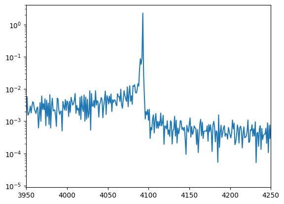
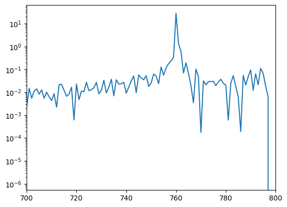
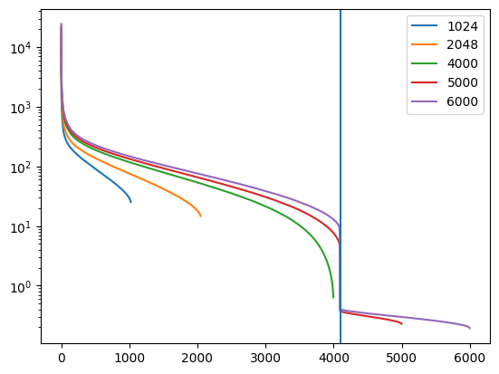

# LM-Head参数窃取算法实现

## 描述

本项目是基于MindSpore和Mindformers对于当今最流行的大型语言模型的 API 进行有针对性的查询，进行提取其嵌入维度或其最终权重矩阵。
目标复现[2403.06634] Stealing Part of a Production Language Model (arxiv.org)结果

## 模型结构

采用华为Mindformers仓库中开源的"llama_7b"配置和"gpt_2"配置进行复现模拟参数窃取算法

## 环境要求

Mindspore=2.9, Mindformers=1.2.0, 使用Ascend硬件平台

## 脚本说明

```markdown
│── readme.md
│── src
│   │── adapters
│   │   │── local_mindformers_gpt2.py
│   │   │── local_mindformers_llama.py
│   │── dim_svd.py
│   │—— svd_plots.py
│   │── metrics.py
│   │── numerics.py
│── ourputs //攻击结果演示
│   │── different_test_of_llama.png
│   │── sigular_values_of_gpt2.png
│   │── log_diff_of_gpt2.png
│   └── log_diff_of_llama.png
│── train.py  //单次攻击脚本
└──  multi_train.py  //多次攻击脚本
```

## 攻击实验：

前言：
对于论文中所使用的开源模型中，由于缺乏Llama_65b配置，Mindformers则未提供所需配置，因此llama仅复现7b结果，gpt_2并未提供权重矩阵参数，因此只比较隐藏维度的复现结果。


- **单查询次数实验**（以Llama_7b(fp16)为例）：
对Llama_7b(fp16)模型进行攻击实验，意图复原其权重矩阵和隐藏维度。
    ```python
        from src.adapters.local_mindformers_llama import MindFormersLlamaAdapter
        # 对于gpt模型：from src.adapters.local_mindformers_gpt2 import MindFormersGptAdapter
        from train import train
        adapter = MindFormersLlamaAdapter("llama_7b")
        train(adapter) # 使用默认参数：num_queries=5000, prompt_len=16, vocab_subset=None, seed=0, batch_size=8
    ```
攻击结果和简要报告保存在`outputs`文件夹中

- **多次查询次数实验**（以Llama_7b(fp16)为例）：
    命令行运行
    ```bash
        python3 multi_train.py --model_name "llama_7b" --prompt_len 128 --vocab_subset None --seed 42 --batch_size 16 --num_queries_list 1024 2048 4000 5000 6000
    ```
其中不同攻击得到的sigular values保存在`temp_results`文件夹中, 攻击得到的最终结果和简要报告保存在`outputs`文件夹中


## 实验结果

#### 单次查询实验

**对于llama_7b配置的攻击结果**：

```text
prompt_len:16
vocab_used:32000
h_est:4093
rms_aligned:0.0002823424886589567
```

得到的隐藏层大小为4093，与文献中的标准结果4096$\pm$2，误差大小接近在0.07%，满足攻击结果要求
而权重矩阵的实验值与真实配置的误差大小在2$\times 10^{-4}$,接近文档平均误差大小水平：$10^{-4}$至$10^{-5}$水平，攻击实验合理完成
**对于gpt2配置的攻击结果**：

```text
h_est:761
```

本次实验得到的h大小为761，文献得到结果为757$\pm$1，真实结果为768，因此可知本次复现结果合理有效

#### 多次查询实验

```text
.......
----- Summary -----
=== 攻击实验评估报告 ===
model:llama_7b
num_queries:5000
prompt_len:16
vocab_used:32000
h_est:4093
rms_aligned:0.0003705834606818188
----- Summary -----
=== 攻击实验评估报告 ===
model:llama_7b
num_queries:6000
prompt_len:16
vocab_used:32000
h_est:4093
rms_aligned:0.0002823424886589567
```


后言：
可通过增加num_queries、改变seed的方式多次对模型进行攻击和实验，提高结果精度。