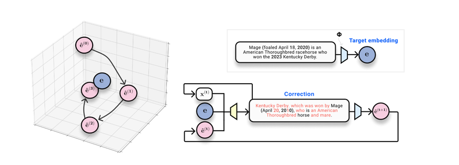
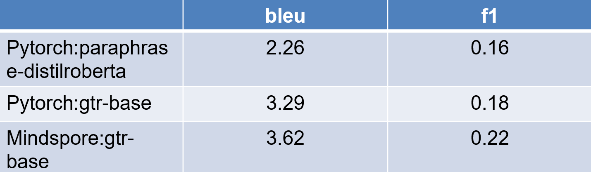
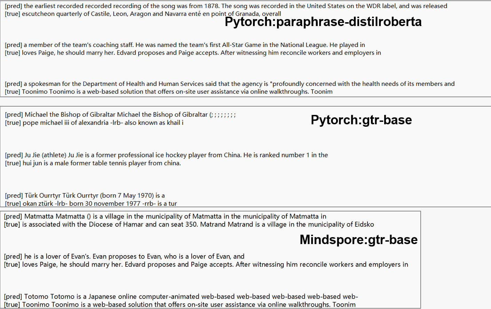

# vec2text embedding inversion

## 0.项目相关

本仓库主要是对嵌入进行反转，具体的技术细节在这篇文章中**[Text Embeddings Reveal (Almost) As Much As Text (EMNLP 2023)](https://arxiv.org/abs/2310.06816)**.

主要目的是将论文[相关仓库](https://github.com/jxmorris12/vec2text)的代码迁移到华为mindspore的SIG社区mindarmor上，增强安全性的技术工具。

论文主要的内容是：

**控制生成方法**：作者将其方法描述为一个控制生成问题，目标是生成与给定嵌入尽可能匹配的文本。这涉及生成文本，使得重新嵌入后，它保持接近原始嵌入在潜在空间中的位置。**目的是**构建一个系统，该系统可以采用真实嵌入、假设文本序列和嵌入空间中的假设位置，并预测真实文本序列。

**迭代细化**：采用**迭代过程**，其中生成一个初始假设，然后通过一系列步骤进行细化。每一个细化步骤都涉及生成一个新的假设，根据当前假设的嵌入与目标嵌入之间的差异，更好地与目标嵌入对齐。

**模型架构**：模型使用为嵌入反演任务适配的基于 Transformer 的encoder-decoder架构。它包含了比较嵌入和调整生成文本的机制。

## 1.训练指令

第一阶段的目前的环境配置：

> GPU环境
>
> python3.9
>
> mindspore2.2.14+
>
> mindnlp0.4.0

这个仓库中的大部分代码用于训练 inversion models，训练过程大致分为**三个步骤：**

1. 训练一个“零步”模型，用于从 embeddings 生成文本。
2. 使用零步模型生成“假设”，作为纠正模型的训练数据。
3. 训练一个纠正模型，条件是（真实的 embedding，假设，假设 embedding）三元组，以生成纠正后的文本。

也就是说代码的训练包括两个部分，第一部分是inversion阶段(step1)，第二个部分是corrector阶段（step2,3）。当前仓库支持第一阶段inversion的训练代码的迁移，并正在努力进行第二阶段的迁移。

**其中第一阶段的迁移代码的基本的指令如下：**

> python3 run.py --per_device_train_batch_size 128 --per_device_eval_batch_size 128 --max_seq_length 32 --model_name_or_path **google-t5/t5-base** --dataset_name **nq** --embedder_model_name **gtr_base** --num_repeat_tokens 16 --embedder_no_grad True --num_train_epochs **20** --max_eval_samples **16** --eval_steps 10 --warmup_steps 300 --bf16=1 --use_frozen_embeddings_as_input False --experiment inversion --learning_rate 0.001 --output_dir ./saves/gtr-1 --save_steps 10000000000 --use_less_data **2560**

接下来分别解释一下以下参数,具体的参数在代码中也有解释，这里主要强调以下**几个参数：**

google-t5/t5-base是用来inversion的模型，gtr_base是嵌入的模型，nq是一个50多万条文本数据的数据集。

use_less_data是使用的其中的训练集的数量，max_eval_samples这是验证集的数量（不要设置很多，因为要评估以及逆转回text，会有点儿慢）

## 2.一些踩坑点

因为本项目原来高度依赖transformer库（huggingface中），但是因为transformer库对mindspore没有支持。

所以迁移的技术路线选择的是mindnlp社区的对transformer复现的相关配套API,然而mindnlp社区的transformer的复现的支持不是非常完善，有一个比较严重的问题是：GPU跑相关代码时会发生训练单个step的时间线性增加，这影响了整体的训练效率，对于此bug已提issue，社区负责人也在积极解决中，因此本实验在有限的训练轮次中对比实验结果。

当然，一个解决方案是使用Ascend进行训练，因为Ascend卡对于mindspore和mindnlp更加配套，此bug可能不复存在。

## 3.实验结果

### 1.对比试验

分别对nq数据集的25600条数据跑了10个epoch，实验结果如下：

* 分别做了三组实验，变量是mindspore和pytorch，gtr-base和paraphrase-distilroberta嵌入模型。

* 可以看出在同等训练数据和轮次的情况下取得相当的性能，初步证明代码迁移成功。

* 后续还需要在申请成功的Ascend资源下进一步验证实验的精度准确性

### 2.案例分析

* 在mindspore上的训练效果，可以能精确的预测出love,propose,municipality，village等单词，直观上验证我们的迁移结果不错。

## 4.后续的工作完善

* 在Ascend上解决inner_training_loop的过程中，step线性变慢的问题
* 继续corrector阶段的复现，增强嵌入反转的效果