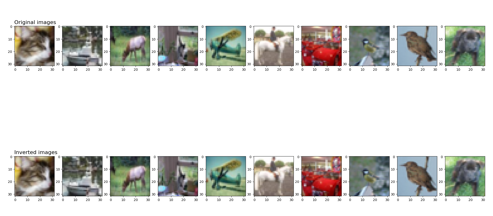
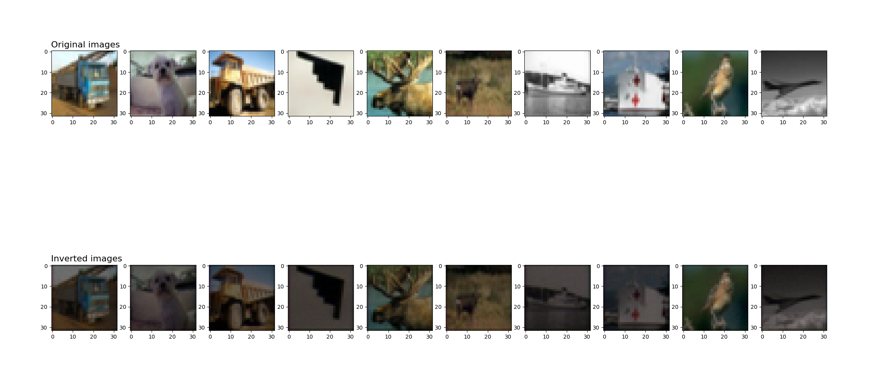

# 模型逆向攻击

使用MindSpore框架和MindArmour工具包实现的CIFAR-10图像反演攻击的Python脚本。该脚本利用深度学习模型对CIFAR-10数据集中的图像进行反演攻击，以评估模型的隐私保护能力。构造原始模型相应的逆向模型进行训练，将原始模型输出作为逆向模型输入，原始模型输入作为逆向模型输出。

## 脚本说明

### 1. 加载模型参数及数据集

```python
# 加载训练好的网络参数
load_dict = load_checkpoint(ckptpath)
load_param_into_net(net, load_dict)
# 获取原始数据
ds = generate_dataset_cifar(data_list, 32, repeat_num=1)
ds_test = generate_dataset_cifar(data_list, 32, repeat_num=1)
```

### 2. 运行攻击

定义逆向网络`inv_net`，保证逆向网络输入与原始网络输出一致，逆向网络输出与原始网络输入一致。

```python
model_inversion_attack = ModelInversionAttack(net, inv_net, input_shape=(3, 32, 32), split_layer='conv11')
model_inversion_attack.train_inversion_model(ds, epochs=100)
```

### 3. 反演图像

```python
# 反演图像
inversion_images = model_inversion_attack.inverse(target_features).asnumpy()
inversion_images = inversion_images.clip(0, 1)
# 评估反演图像质量
avg_ssim, avg_psnr = model_inversion_attack.evaluate(ds_test) LOGGER.info(TAG, '原始图像与反演图像之间的平均ssim值是：{}'.format(avg_ssim))
LOGGER.info(TAG, '原始图像与反演图像之间的平均psnr值是：{}'.format(avg_psnr))
```

## 逆向攻击参数介绍

1.`ModelInversionAttack` 模块介绍

```Python
class ModelInversionAttack:
    def __init__(self, network, inv_network, input_shape, ckpoint_path=None, split_layer='conv1'):
...
```

构建模型逆向攻击对象
输入：

- netword：原始网络
- inv_network：逆向网络
- input_shape：输入图像维度
- ckpoint_path：逆向网络参数
- split_layer：原始网络输出层

2. 逆向网络训练

```python
def train_inversion_model(self, dataset, epochs=50, learningrate=1e-3, eps=1e-3, apply_ams=True):
```

训练逆向网络
输入：

- dataset：原始数据集或构造数据集
- epochs：训练轮次
- learningrate：训练学习率
- eps：增加数值计算稳定性
- apply_ams：启用自适应移动平均

## 攻击效果



# 影子模型攻击

使用MindSpore框架和MindArmour工具包实现的CIFAR-10影子模型攻击的Python脚本。该脚本利用深度学习模型对CIFAR-10数据集中的图像进行反演攻击，以评估模型的隐私保护能力。构造与原始模型输入输出维度一致的影子模型，使得通过对影子模型进行参数逆向攻击达到与原始模型参数逆向攻击一致的效果。

## 脚本说明

### 1. 加载模型参数及数据集

```python
# 加载训练好的网络参数
load_dict = load_checkpoint(ckptpath)
load_param_into_net(net, load_dict)
# 获取原始数据
ds = generate_dataset_cifar(data_list, 32, repeat_num=1)
ds_test = generate_dataset_cifar(data_list, 32, repeat_num=1)
```

### 2. 构造影子模型

```python
# 运行攻击
shadow_model_attack = ShadowModelAttack(net, shadow_net, split_layer='conv11')
shadow_model_attack.train_shadow_model(ds, attack_config={'epochs': 100}) shadow_model_attack.evaluate(ds_test, 10)
```

### 3. 反演影子模型

```python
# 图像反演
inversion_attack = ImageInversionAttack(shadow_net, (3, 32, 32), input_bound=(0, 1), loss_weights=(1, 0.1, 5))
inversion_images = inversion_attack.generate(target_features, iters=150)
# 评估反演图像质量
avg_l2_dis, avg_ssim, _ = inversion_attack.evaluate(original_images, inversion_images)
LOGGER.info(TAG, '原始图像与反演图像之间的平均L2距离是：{}'.format(avg_l2_dis))
LOGGER.info(TAG, '原始图像与反演图像之间的平均ssim值是：{}'.format(avg_ssim))
```

## 影子模型攻击参数介绍

1. `ShadowModelAttack`

```python
class ShadowModelAttack:
    def __init__(self, network, shadow_network, ckpoint_path='', split_layer='conv1'):
```

构建影子模型攻击对象
输入：

- netword：原始网络
- shadow_network：影子网络
- ckpoint_path：逆向网络参数
- split_layer：原始网络输出层

1. 影子网络训练

```python
def train_shadow_model(self, dataset, attack_config):
```

- dataset：原始数据集或构造数据集
- attack_config ={"epochs": 50, "learningrate": 1e-3, "eps": 1e-3,"num_classes": 10, "apply_ams": True}
    - epochs：训练轮次
    - learningrate：训练学习率
    - eps：增加数值计算稳定性
    - num_classes：模型输出类别
    - apply_ams：启用自适应移动平均

## 影子模型攻击效果


